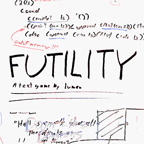
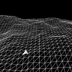

<h1 align="center">Hi 👋, I'm Aidan "Lumen" Moran </h1>
<h4 align="center">Game & Software dev, horticulturist, and writer</h4>

- 🔭 I’m currently working on **School, research, and my next game**

- 🌱 I’m currently learning **Unity, JavaScript, A.I., and quantum computing**

- 📄 See more about me on my website <a href="https://www.interstellarshareware.net">**interstellarshareware.net**</a>

- 📫 Reach me at **interstelaidan@gmail.com**

- 🕴️ Currently Working as **Makerspce tech**

## Favorite Project Shortcuts
| <a href="https://github.com/Lumen-git/ThingsAI"> 
ThingsAI: Dynamic Mosaic Generator
</a> | <a href="https://interstellarshareware.net/games/futility/"> 
Futility: A Text Game
</a> | <a href="https://www.moddb.com/mods/backdooms"> Backdooms: An Exploration Mod for a 30 Year Old Game</a> | <a href="https://github.com/Lumen-git/TheToyBox"> The Toy Box: Experiments in Computer Science</a> |
|:---:|:---:|:---:|:---:|

<h3 align="center">Connect with me:</h3>

 

<h3 align="center">Languages and Tools:</h3>

          

<b>+Racket, FDM and SLA 3D printing, and laser cutting</b>

  

&nbsp;

Thanks to @rahuldkjain for their wonderful readme generator and @TodePond for the inspiration for using markdown tables in the readme!
